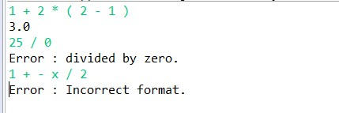

# Socket-Program-Calculator

This is **a calculator which is socket programming**.

### What language did you use?
- I used *Java*.

### Architecture & Description
- Calculator server is waiting for contact from client. Server get data file which has *server's ip address* and *port number*, then client read this data file to *make a socket*. Client gets String infix expression and send it to server for calculate. Server reads *client request*, then split the string by " " and save it to the string array.
- First, *except* method is called to check the errors whether input elements are correct. Second, *postfix* method is called and translate infix string array to postfix integer array. Finally, when *calculate* method is called, this method determine the protocol (client's request) is appropriate or calculated result.
- Then *server responds* to client calculation result or message if message from client format is wrong.

### Message format
- Client has to request to server in infix format. Operators can’t come repeatedly, and operator can’t come at the first or the last. Possible input elements are *4 operators, (, ), integers* and *OK* message. Then server will respond to client result or error message.

### Screenshot of test cases
  

- type *OK*

